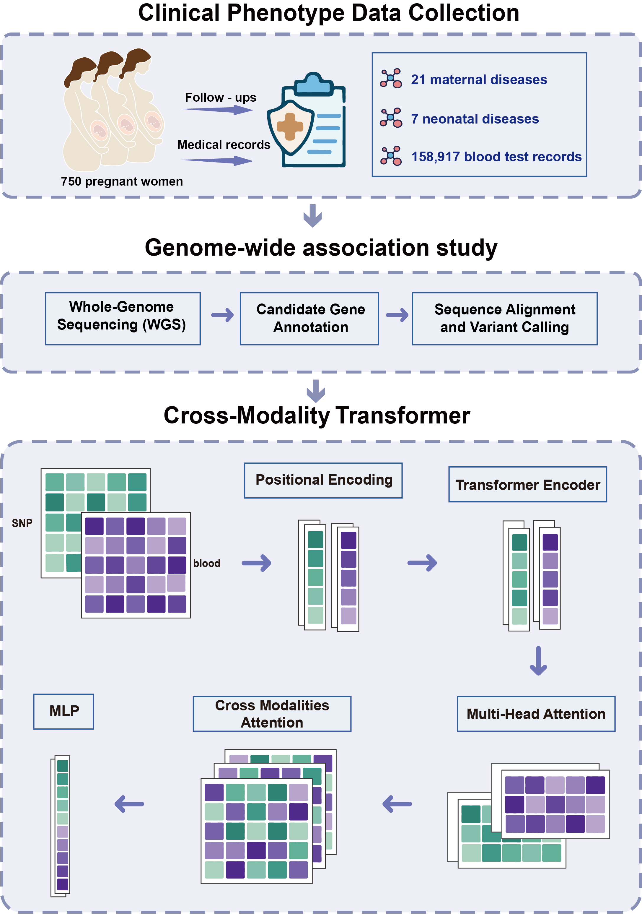

# Transformer-Based Prediction of Maternal and Neonatal Outcomes

A transformer-based multimodal model integrates genomic variants and longitudinal maternal biomarkers to predict pregnancy-related maternal and neonatal outcomes.

## Workflow

<p align="center"></p>

This workflow summarizes the overall study design and analysis framework. Maternal clinical records, longitudinal laboratory indicators, and genomic variant information are integrated to construct disease-specific prediction models for maternal and neonatal outcomes. The analysis includes phenotype definition, GWAS-based variant screening, feature integration, transformer-based model training, cross-validation, performance evaluation, and model interpretation using SNP-level importance scores.

## GWAS Analysis

The GWAS analysis in this project was performed with reference to the lightweight GWAS workflow generator maintained in the following repository:

[cfDNA_GWAS_generator](https://github.com/CKNckn11/cfDNA_GWAS_generator)

This referenced workflow provides a reproducible framework for organizing GWAS input files, running association analysis, and generating downstream visualization-ready results. In the present project, GWAS-derived variants were further integrated with maternal clinical and laboratory features for transformer-based risk prediction.

### cfDNA GWAS Pipeline Generator

This tool is designed to generate reproducible analysis scripts rather than directly execute all jobs inside Python. After generation, each shell script can be submitted, checked, modified, or rerun independently on a local server or computing cluster.

```bash
$ python generate_pipeline.py -h
usage: cfdna-gwas-generate [-h] [-v] --config CONFIG [--outdir OUTDIR]

cfDNA GWAS Pipeline Generator (Version = 0.1.0): Generate cfDNA germline GWAS shell scripts from a YAML config.

optional arguments:
  -h, --help       show this help message and exit
  -v, --version    show the version of cfdna-gwas-generate and exit.
  --config CONFIG  YAML config file.
  --outdir OUTDIR  Override project.outdir from the YAML config.
```

## Code Organization

The analysis scripts are organized by figure under the `Code/` directory:

- `Code/Figure1/`: gestational age plotting and pregnancy subtype boxplot code.
- `Code/Figure2_3_4/`: Manhattan plot code for GWAS results.
- `Code/Figure5/`: model 1 code, diagnostic metric plotting, and SNP SHAP lollipop plotting.
- `Code/Figure6/`: model 2 code, diagnostic metric plotting, and SNP SHAP lollipop plotting.
- `Code/Supplementary_Figures/`: supplementary QQ plot, locuszoom plot, and extended data table scripts.

## Project Aim

This repository supports a multimodal prediction framework for maternal and neonatal outcomes. By combining genetic variants with longitudinal maternal features, the project aims to improve early risk stratification and provide interpretable biomarkers for pregnancy-related complications.